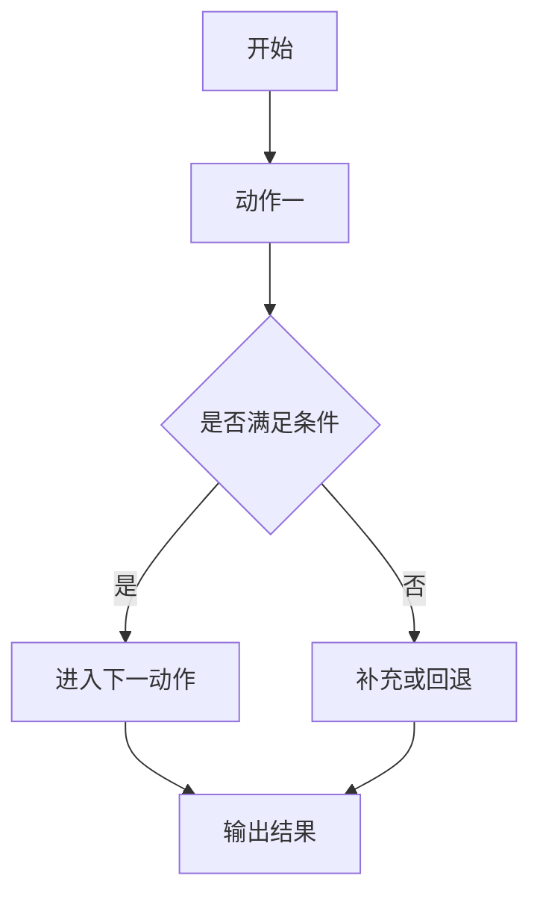

# Ralplan 细化方案生成器

## 使用目标

本 Skill 用于在 `ralplan` 完成后，基于其最终输出继续生成一份**更具体、可执行、可交付**的中文实施方案。

该实施方案必须满足以下要求：

1. **以 ralplan 最终方案为输入**
2. **按功能维度拆分，而不是按时间维度泛泛描述**
3. **最少拆分为 3 个功能点**
4. **功能实现超过2个步骤的必须附带 Mermaid 流程图，流程图是针对功能开发，不需要考虑测试验证**
5. **每个功能都要补充明确的目标、前置条件、执行动作、边界条件，产出物、验收点**
6. **有ui视觉相关的，将ui视觉相关功能独立拆分，至少拆1个功能点** 
7. **文档内容要通俗易懂**

当用户表达以下意图时应使用本 Skill：

- “在 ralplan 后再细化一份具体方案”
- “把 ralplan 的结果拆成执行步骤”
- “给 ralplan 方案补流程图”
- “把规划继续细化到功能级别”
- “基于 ralplan 再出一份落地实施方案”

---

## 使用方式

### 推荐调用方式

```text
$ralplan-detail-plan <ralplan 最终方案或其摘要>
```

### 典型使用场景

```text
$ralplan-detail-plan
请基于下面这份 ralplan 最终方案，输出一份更具体的中文实施方案：
1. 按功能拆分为至少 3 个功能
2. 功能实现超过2个步骤的补 Mermaid 流程图
3. 明确每步的输入、输出、依赖、边界条件和验收点
```

---

## 输入要求

执行本 Skill 时，优先使用以下输入来源：

1. **当前对话里刚刚生成的 ralplan 最终方案**
2. 用户显式粘贴的 ralplan 内容
3. 已保存的 ralplan 计划文档、PRD、test spec 或 handoff 内容

如果存在多个版本，优先使用**最新且已定稿**的版本。

如果 ralplan 内容不完整，也应尽量继续细化，但必须显式标注：

- 哪些内容来自原始方案
- 哪些内容属于合理推断
- 哪些部分仍需用户补充

---

## 核心行为

### 1. 先理解原始 ralplan 的结构

在输出细化方案前，先从原始 ralplan 中提炼：

- 总目标
- 关键功能块
- 约束条件
- 风险点
- 验证要求
- 建议执行路径

如果原方案本身已经包含阶段划分，不要机械复述，而是要**进一步按功能职责细化**。

### 2. 强制拆分为至少 3 个功能步骤

步骤数量规则：

- 默认输出 **3~6 个步骤**
- 不允许少于 **3 个步骤**
- 若原方案复杂度较高，可拆成更多步骤
- 步骤命名应体现功能职责，例如：
  - 步骤一：上下文收集与边界确认
  - 步骤二：核心模块改造
  - 步骤三：联调与验证闭环

禁止仅输出如下空泛步骤：

- 第一步：分析
- 第二步：开发
- 第三步：测试

除非原任务确实只允许这种结构，否则必须进一步细化成具体功能单元。

### 3. 功能实现超过2个步骤的补 Mermaid 流程图

功能实现超过2个步骤的必须包含一个 Mermaid `flowchart TD` 或 `flowchart LR` 图。

流程图要求：

- 节点数量建议 4~8 个
- 节点名称要贴合当前步骤的真实动作
- 至少体现开始、处理分支、结果输出
- 如果步骤包含判断逻辑，应使用判断节点
- 不需要画得过大，但必须具备可读性

### 4. 输出必须面向执行

输出不只是“解释方案”，而是要达到**可以直接继续执行**的程度。因此每个步骤应补充：

- 本步骤目标
- 输入条件
- 核心执行动作
- 输出结果
- 依赖关系
- 验收标准
- 风险/注意事项（如有）

### 5. 保持中文输出

最终结果必须使用中文输出，术语尽量统一，避免中英混杂。

---

## 输出结构

最终输出时，优先使用以下结构。

### A. 方案总览

先给出一段简短总览，包括：

- 本次细化基于哪份 ralplan
- 总目标是什么
- 共拆分为几个步骤
- 这些步骤之间的总体依赖关系

### B. 步骤列表

每个步骤必须使用以下模板：

```markdown
## 步骤 X：<步骤名称>

### 1. 目标
- ...

### 2. 输入
- ...

### 3. 执行动作
1. ...
2. ...
3. ...

### 4. 输出
- ...

### 5. 依赖与衔接
- 上游依赖：...
- 下游影响：...

### 6. 验收点
- ...

### 7. 流程图

```

### C. 总体验证闭环

在所有步骤后，再补一节：

- 整体验证方式
- 关键里程碑
- 是否适合交给 ralph / team / goal-mode 执行
- 如需继续执行，建议的下一条 prompt

---

## 输出质量要求

生成内容时必须满足以下质量标准：

### 必须做到

- 至少 3 个步骤
- 每个步骤都有 Mermaid 流程图
- 每个步骤都体现功能边界
- 每个步骤都具备输入/输出/验收点
- 明确依赖关系与执行顺序

### 尽量做到

- 将复杂任务拆成可以并行或串行执行的清晰单元
- 用与 ralplan 一致的术语描述对象、模块和目标
- 保持步骤粒度均衡，不要一个步骤过大、其余步骤过空

### 避免出现

- 直接复制 ralplan 原文而不细化
- 步骤名过于空泛
- 没有流程图
- 流程图与文字内容不一致
- 把“测试”“开发”“部署”当作唯一拆分方式而没有功能边界

---

## 推理与细化原则

当原始 ralplan 结构较粗时，可按以下优先级拆分：

1. **按业务功能模块拆**
2. **按系统责任边界拆**
3. **按数据流转阶段拆**
4. **按执行依赖顺序拆**

优先输出“用户真正能拿来执行”的方案，而不是抽象分析。

如果原始 ralplan 已经有明确模块，可对每个模块进一步细化为：

- 准备
- 实施
- 校验

但最终对外展示时，仍应保持**功能步骤**为主，而不是变成流水账。

---

## 与 ralplan 的衔接规则

本 Skill 是 `ralplan` 的后置细化器，不替代 `ralplan` 的职责。

职责边界如下：

- `ralplan`：负责形成高质量、经审视的总体方案与执行路径
- `ralplan-detail-plan`：负责把最终方案继续细化成可执行的步骤化蓝图

如果当前任务还没有完成 `ralplan`，应先提示：

1. 建议先运行 `ralplan`
2. 待得到最终方案后，再运行本 Skill 进行二次拆解

---

## 建议输出结尾

输出最后建议补充一段简短建议，例如：

- 如果需要，我可以继续把这份步骤化方案转换成 `ralph` 可直接执行的 prompt
- 如果需要，我可以继续把这份方案转换成 team 任务分配清单
- 如果需要，我可以继续把 Mermaid 流程图整理成统一风格

---

## 简短示例

```markdown
# 基于 ralplan 的细化实施方案

本方案基于最新的 ralplan 最终稿，目标是将原有总体规划进一步拆解为 3 个可执行功能步骤，并为每个步骤补充流程图与验收要求。

## 步骤一：需求边界与上下文确认
...

## 步骤二：核心功能拆解与执行设计
...

## 步骤三：验证闭环与执行交接
...
```

---

## 一句话规则

**拿到 ralplan 最终方案后，不停留在“计划说明”，而是继续产出一份中文、至少 3 步、功能实现超过2个步骤的带 Mermaid 流程图的功能级实施方案。**
