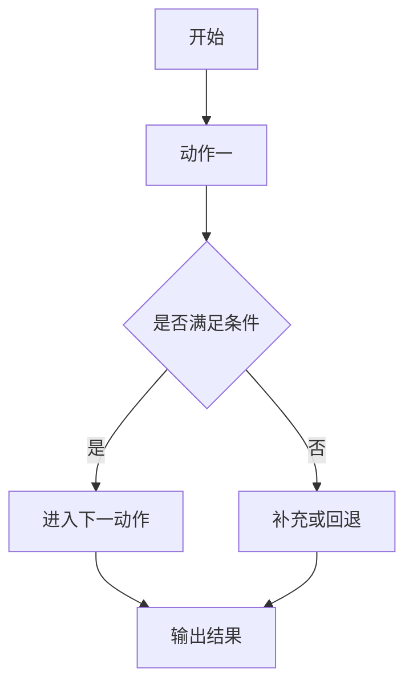

# Ralplan 细化方案生成器

## 使用目标

本 Skill 用于在 `ralplan` 完成后，基于其最终输出继续生成一份**更具体、可执行、可交付、低歧义**的中文实施方案。

## 落盘规则

本 Skill 的输出**必须默认保存为文件**，而不是只停留在对话里。

### 保存位置

- 默认保存到仓库专门的实施目录：`.omx/implementations/`
- 如果该目录不存在，先创建该目录，再保存文件。
- 默认文件名格式：`<原始 ralplan 文件名去掉扩展名>-detail-plan.md`
- 如果输入已经是某个固定方案名称，则保留该方案前缀，例如：
  - 输入：`.omx/plans/demo-list-controller-simplification-scheme-c-reevaluation.md`
  - 输出：`.omx/implementations/demo-list-controller-simplification-scheme-c-detail-plan.md`

### 保存要求

1. 先整理完整 Markdown 内容，再保存到 `.omx/implementations/` 下对应的 `-detail-plan.md` 文件。
2. 保存完成后，在最终输出中明确说明：
   - 保存了哪个文件
   - 是否已按实施方案标准落盘
3. 若上下文不足以稳定确定文件名，也要先给出最合理的默认文件名，并说明假设。

该实施方案必须满足以下要求：

1. **以 ralplan 最终方案为输入**
2. **按功能维度拆分，而不是按时间维度泛泛描述**
3. **最少拆分为 3 个功能步骤**
4. **以功能维度拆分为主，但仍需补充必要的优先级、依赖顺序和里程碑信息，支持继续执行与协同**
5. **当某个步骤包含 3 个及以上动作、判断分支、异步状态流转或跨模块协作时，必须附带 Mermaid 流程图；简单步骤可不画**
6. **每个功能步骤都要补充明确的来源依据、目标、范围边界、非目标、输入、输出、工程动作、兼容性/不变量、依赖、测试用例、风险与回归点**
7. **有 UI 视觉相关的，将 UI 视觉相关功能独立拆分，至少拆 1 个 UI 视觉功能步骤**
8. **文档内容要通俗易懂**

---

## 使用方式

### 推荐调用方式

```text
$ralplan-detail-plan <ralplan 最终方案或其摘要>
```

---

## 输入要求

执行本 Skill 时，优先使用以下输入来源：

1. **当前对话里刚刚生成的 ralplan 最终方案**
2. 用户显式粘贴的 ralplan 内容
3. 已保存的 ralplan 计划文档、PRD、test spec 或 handoff 内容

如果存在多个版本，优先使用**最新且已定稿**的版本。

### 无参调用时的输入选择规则

如果用户只调用 `$ralplan-detail-plan` 而没有显式附带 ralplan 内容，按以下顺序查找输入：

1. 当前对话中最近一次完整的 ralplan 最终方案
2. 用户当前消息中显式提到的 `.omx/plans/*.md` 文件
3. `.omx/plans/` 下最近修改、且文件名看起来像最终方案的文档，例如包含 `final`、`scheme`、`approved`、`reevaluation`
4. 若存在多个候选，优先选择最近修改时间最新且内容最完整的版本

如果仍无法稳定确定输入来源，必须显式说明：

- 候选来源有哪些
- 最终选择依据是什么
- 哪些地方仍存在不确定性

如果 ralplan 内容不完整，也应尽量继续细化，但必须显式标注：

- 哪些内容来自原始方案
- 哪些内容属于合理推断
- 哪些部分仍需用户补充
- 哪些结论需要继续回仓库或原方案核实

### 文件命名回退规则

如果输入不是现成文件，而是对话中的纯文本方案或粘贴内容，文件名按以下顺序生成：

1. 优先使用原始方案标题生成 slug
2. 若没有明确标题，则从总目标提取 3~8 个关键词生成 kebab-case slug
3. 若仍无法稳定生成，则使用 `ralplan-detail-plan-<YYYYMMDD-HHMM>` 作为回退名称

最终文件名统一为 `<slug>-detail-plan.md`。

如果采用了回退文件名，必须在最终输出中说明命名依据。

---

## 核心行为

### 1. 先理解原始 ralplan 的结构

在输出细化方案前，先从原始 ralplan 中提炼：总目标、关键功能块、约束条件、风险点、验证要求、建议执行路径。

如果原方案本身已经包含阶段划分，不要机械复述，而是要**进一步按功能职责细化**。

### 2. 强制拆分为至少 3 个功能步骤

步骤数量规则：

- 默认输出 **3~6 个步骤**
- 不允许少于 **3 个步骤**
- 若原方案复杂度较高，可拆成更多步骤
- 步骤命名应体现功能职责，而不是阶段标签，例如“上下文收集与边界确认”“核心模块改造”“联调与验证闭环”

禁止仅输出如下空泛步骤：

- 第一步：分析
- 第二步：开发
- 第三步：测试

除非原任务确实只允许这种结构，否则必须进一步细化成具体功能单元。

术语约束：

- 对外统一使用 **功能步骤** 表述，不再混用“功能点”“阶段”“任务点”
- 每个功能步骤都应对应一个可以被继续执行的职责单元
- 禁止把纯时间阶段直接当成功能步骤名称

### 3. 按复杂度决定是否补 Mermaid 流程图

当某个功能步骤满足以下任一条件时，必须包含一个 Mermaid `flowchart TD` 或 `flowchart LR` 图：

- 执行动作达到 3 个及以上
- 包含条件判断或失败回退分支
- 存在异步状态流转
- 存在跨模块、跨角色或跨系统协作

流程图要求：

- 节点数量建议 4~8 个
- 节点名称要贴合当前步骤的真实动作
- 至少体现开始、处理分支、结果输出
- 如果步骤包含判断逻辑，应使用判断节点
- 不需要画得过大，但必须具备可读性

简单步骤若只有 1~2 个直接动作、没有分支、没有异步状态切换，可不画流程图，但要在文字中明确说明省略理由。

### 4. 输出必须面向执行

输出不只是“解释方案”，而是要达到**可以直接继续执行**的程度。因此每个步骤至少补充：来源依据、目标、范围边界与非目标、输入、执行动作、输出、兼容性与不变量、依赖与联动检查点、测试用例、风险与回归点，以及**推荐执行方式**。

工程约束补充：
- 每个功能步骤都要说明该步骤后续更适合如何推进，例如：`analyze`、直接执行、`ralph`、`ralplan`、`team`、`ultraqa` 或 goal-mode。
- 推荐执行方式要说明简短原因，重点解释该步骤为什么适合该执行面。
- 不要机械套用同一个 workflow；应根据步骤的风险、依赖、验证强度、并行价值来判断。
- 如果当前环境不支持某些 OMX runtime workflow，应将其表述为**后续建议执行方式**，而不是当前必须立即调用。

工程约束：

- 执行动作必须尽量落到具体工程对象，例如模块、目录、文件、类、组件、Provider、接口、路由、状态流、数据模型、构建产物
- 禁止使用“优化相关逻辑”“完善交互流程”“处理异常情况”这类无法直接执行的空泛表述，除非后面紧跟具体模块或文件
- 输入与输出必须具备可验证性；输入至少说明代码入口、依赖模块或前置条件，输出至少说明变更文件、产出物或预期行为变化
- 每个步骤都要明确哪些行为必须保持不变，哪些兼容性不能破坏

## 功能步骤的执行方式选择

在输出 detail plan 时，每个功能步骤都要补充“推荐执行方式”，用于说明后续更适合如何推进执行。

默认判断规则：
- 以只读分析、影响面确认、证据收敛、基线核对为主：优先 `analyze`
- 边界清楚、范围较小、通常一轮可收敛：优先直接执行
- 涉及多文件改动、需要持续修复与验证闭环、不能接受半成品：优先 `ralph`
- 步骤本身仍缺少清晰边界、存在多方案取舍、需要再细化：优先 `ralplan`
- 存在多条独立且可并行推进的子线：考虑 `team`
- 以测试、复现、修复、回归收敛为主：可考虑 `ultraqa`

注意：
- 不要机械套用以上映射，应以步骤的真实目标、依赖关系和验证压力为准。
- 如果某个步骤同时符合多个执行面，优先选择**最轻但仍能保证质量**的方式。
- 如果需要推荐 `ralph` / `team` / `ultraqa` 等 runtime workflow，但当前环境不支持立即启动，也应在文档中保留其“后续建议执行方式”定位。

### 5. 保持中文输出

最终结果必须使用中文输出，术语尽量统一，避免中英混杂。

---

## 输出结构

### A. 方案总览

先给出一段简短总览，包括：

- 本次细化基于哪份 ralplan
- 总目标是什么
- 共拆分为几个步骤
- 这些步骤之间的总体依赖关系
- 哪些步骤属于关键路径
- 哪些步骤可以并行
- 本次细化中的主要假设与待确认点
- 本次范围包含什么、不包含什么

### B. 步骤列表

每个步骤必须使用以下模板：

```markdown
## 步骤 X：<步骤名称>

### 0. 来源依据
- 对应原始 ralplan：...
- 工程化补全：...
- 合理推断：...

### 1. 目标
- ...

### 2. 范围边界
- 本步骤包含：...
- 本步骤不包含：...

### 3. 非目标
- 本步骤不处理：...
- 后续步骤再处理：...

### 4. 输入
- 代码入口：...
- 依赖模块 / 文件：...
- 前置条件：...

### 5. 执行动作
1. 明确写出将修改的模块、文件、类、组件、接口或状态流动作
2. ...
3. ...

### 5.5 推荐执行方式
- 推荐命令：...
- 原因：...
- 备注：若有并行建议、环境限制或明显不适合的 workflow，可补充；否则可省略

### 6. 输出
- 变更文件：...
- 新增产物：...
- 预期行为变化：...

### 7. 兼容性与不变量
- 必须保持不变：...
- 兼容性要求：...
- 回归关注点：...

### 8. 依赖与衔接
- 上游依赖：...
- 下游影响：...
- 联动检查点：...

### 9. 测试用例
- 正常场景：...
- 边界场景：...
- 异常场景：...

### 10. 风险与回归点
- 主要风险：...
- 高风险位置：...
- 回归重点：...

### 11. 流程图（按需提供）

```

### C. 总体验证闭环

在所有步骤后，再补一节，包含：整体验证方式、关键里程碑、关键路径与并行建议、总体兼容性与回归关注点、各步骤的推荐执行方式汇总、是否适合交给 `ralph` / `team` / goal-mode 执行，以及一条可直接执行的下一条 prompt。

---

## 输出质量要求

### 必须做到

- 至少 3 个步骤
- 每个步骤都体现功能边界与非目标
- 每个步骤都具备来源依据、输入/输出/测试用例
- 每个步骤都体现兼容性或不变量约束
- 明确依赖关系与执行顺序
- 复杂步骤提供 Mermaid 流程图；简单步骤说明为何可省略
- 执行动作落到工程对象，而不是空泛描述

### 尽量做到

- 将复杂任务拆成可以并行或串行执行的清晰单元
- 用与 ralplan 一致的术语描述对象、模块和目标
- 保持步骤粒度均衡，不要一个步骤过大、其余步骤过空
- 明确标出关键路径、并行项与主要假设

### 避免出现

- 直接复制 ralplan 原文而不细化
- 步骤名过于空泛
- 对简单步骤强行补无信息量的流程图
- 流程图与文字内容不一致
- 把“测试”“开发”“部署”当作唯一拆分方式而没有功能边界
- 使用“优化”“完善”“处理一下”这类没有工程对象的表述
- 没有说明兼容性、不变量或回归重点

---

## 推理与细化原则

当原始 ralplan 结构较粗时，可按以下优先级拆分：

1. **按业务功能模块拆**
2. **按系统责任边界拆**
3. **按数据流转阶段拆**
4. **按执行依赖顺序拆**

优先输出“用户真正能拿来执行”的方案，而不是抽象分析。

如果原始 ralplan 已经有明确模块，可对每个模块进一步细化为：

- 准备
- 实施
- 校验

但最终对外展示时，仍应保持**功能步骤**为主，而不是变成流水账。

如果原始 ralplan 只给出高层方向，优先把细化内容落到仓库结构和工程对象：

- 先识别模块、目录、文件、接口或状态边界
- 再定义每个功能步骤的具体改动和不变量
- 最后补测试用例、回归点和可继续执行的 prompt

---

## 与 ralplan 的衔接规则

本 Skill 是 `ralplan` 的后置细化器，不替代 `ralplan` 的职责。

职责边界如下：

- `ralplan`：负责形成高质量、经审视的总体方案与执行路径
- `ralplan-detail-plan`：负责把最终方案继续细化成可执行的步骤化蓝图

如果当前任务还没有完成 `ralplan`，应先提示：

1. 建议先运行 `ralplan`
2. 待得到最终方案后，再运行本 Skill 进行二次拆解

如果当前运行环境不支持 OMX runtime，则将 `ralph` / `team` 视为后续建议目标，而不是当前必须立即调用的执行方式。

---

## 一句话规则

**拿到 ralplan 最终方案后，不停留在“计划说明”，而是继续产出一份中文、至少 3 个功能步骤、动作落到工程对象、复杂步骤带 Mermaid 流程图的工程约束型实施方案，并默认落盘到 `.omx/implementations/`。**
