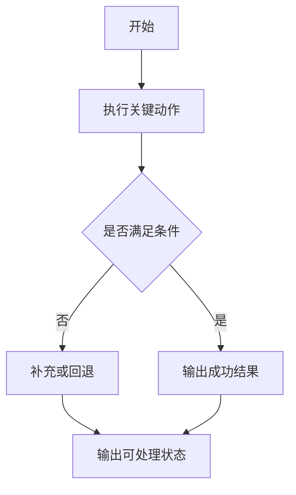

# <方案标题> Detail Plan

## 方案总览

- 基于方案：<ralplan 来源>
- 总目标：<一句话目标>
- 步骤数量：<N 个功能步骤>
- 总体依赖：<步骤之间依赖关系>
- 关键路径：<关键步骤>
- 可并行项：<可并行步骤>
- 主要假设：<假设>
- 待确认点：<待确认>
- 范围包含：<包含内容>
- 范围不包含：<非目标；无 CI/CD 时明确不包含 CI/CD>

## 步骤 X：<功能步骤名称>

### 0. 来源依据
- 对应原始 ralplan：<原文依据或摘要>
- 工程化补全：<为可执行性补足的内容>
- 合理推断：<推断内容；没有写“无”>

### 1. 目标
- <可达成的功能目标>

### 2. 范围边界与非目标
- 本步骤包含：<包含内容>
- 本步骤不包含：<排除内容>
- 移交后续步骤：<后续项；没有写“无”>

### 3. 输入
- 代码入口：<文件/类/路由/Provider/接口>
- 依赖模块 / 文件：<依赖项>
- 前置工程条件：<实施前条件>

### 4. 执行动作
1. <动作落到具体模块、文件、类、组件、接口、Provider、路由或状态流>
2. <动作>
3. <动作>

### 4.5 推荐执行方式
- 推荐方式：<直接执行 / analyze / ralph / ralplan / team / ultraqa / goal-mode>
- 原因：<为什么适合该执行面>
- 备注：<并行建议或环境限制；没有可省略>

### 5. 输出
- 变更文件：<文件列表或范围>
- 新增产物：<产物；没有写“无”>
- 预期行为变化：<可观察变化>

### 6. 兼容性与不变量
- 必须保持不变：<不变量>
- 兼容性要求：<兼容要求>
- 回归关注点：<关注点>

### 7. 依赖与衔接
- 上游依赖：<依赖步骤>
- 下游影响：<影响步骤或模块>
- 联动检查点：<检查点>

### 8. 测试用例
> 默认给出 3 个及以上高价值测试场景；简单步骤可降为 2 个，但需说明简化原因。

- 测试场景：<业务语义名称，覆盖主链路或高风险点>
  - 前置条件：<数据/权限/路由/Mock/接口/缓存/设备>
  - 测试步骤：
    1. <操作或触发>
    2. <验证动作>
  - 预期结果：<可观察、可判定结果>
  - 建议验证层级：<可选>
- 测试场景：<业务语义名称，覆盖失败回退或边界状态>
  - 前置条件：<运行前状态>
  - 测试步骤：
    1. <操作或触发>
    2. <验证动作>
  - 预期结果：<可观察、可判定结果>
  - 建议验证层级：<可选>
- 测试场景：<业务语义名称，覆盖回归或联动风险>
  - 前置条件：<运行前状态>
  - 测试步骤：
    1. <操作或触发>
    2. <验证动作>
  - 预期结果：<可观察、可判定结果>
  - 建议验证层级：<可选>

### 9. 风险与回归点
- 主要风险：<失败模式或不确定性，不重复测试步骤>
- 高风险位置：<文件/模块/接口/Provider/路由/状态流/UI 区域>
- 回归重点：<可能被破坏的既有行为>
- 缓解建议：<可选；预防动作、审查重点或关联测试场景>

### 10. 流程图（按需提供）
<复杂步骤提供 Mermaid；简单步骤说明省略理由。>

## 总体验证闭环

- 整体验证方式：<验证方式>
- 关键里程碑：<里程碑>
- 关键路径与并行建议：<建议>
- 总体兼容性与回归关注点：<关注点>
- 推荐执行方式汇总：<每步方式>
- 后续执行建议：<是否适合 ralph/team/goal-mode>
- 下一条可执行 prompt：`<可复制 prompt>`
